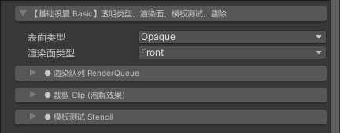
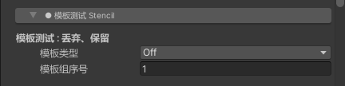
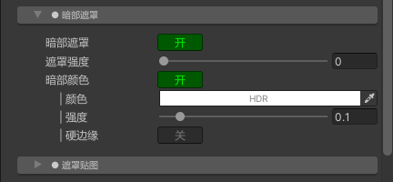
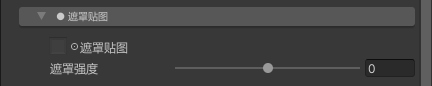
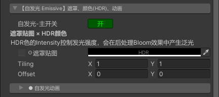
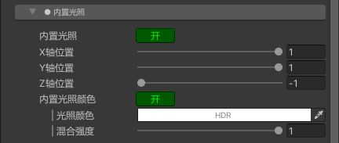
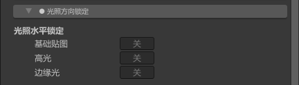

# 【AleToonURP Ver-1.0.0】
- ***阅读中文版用户手册 [中文版本](UserManual.md)***
- ***Read this user manual in [English](UserManual_en.md)***

## 【概述】
---
// TODO

 
 

## 【基础设置】Basic
---

### 1.渲染队列 Render Queue

### 2.裁剪 Clip

### 3.模板测试 Stencil

 
 

## 【基础贴图】 BaseMap
---

| `项目` | 类型 | 功能 |
|:----------------------|:----------------------|:----------------------|
| `基础贴图` | 纹理 Texture | 主要的纹理贴图，这将决定材质球外观的主要美术效果。 |
| `混合颜色` | 颜色 Color | 以插值的方式与基础贴图颜色进行混合。可以很方便得调整基础贴图的颜色。 |
| `混合强度` | 浮点数 Float | 与基础贴图进行颜色混合的强度。 |
| `暗部1颜色` | 颜色 Color | 设置材质球暗部1的颜色。 |
| `暗部2颜色` | 颜色 Color | 设置材质球暗部2的颜色。 |
| `亮部→暗部1 : 位置` | 浮点数 Float | 亮部到暗部1的分界线的位置，通常设置在0.5的位置。 |
| `亮部→暗部1 : 模糊` | 浮点数 Float | 亮部到暗部1的分界线的模糊程度。 |
| `暗部1→暗部2 : 位置` | 浮点数 Float | 暗部1到暗部2的分界线的位置。表现效果始终小于等于“亮部→暗部1 : 位置”。 |
| `暗部1→暗部2 : 模糊` | 浮点数 Float | 暗部1到暗部2的分界线的模糊程度。 |

### 1.暗部阈值贴图 Shade ThresholdMap

 
 

## 【法线贴图】 NormalMap
---

 
 

## 【外描边】 Outline
---

### 1.纹理贴图 TexMap

 
 

## 【边缘光】 RimLight
---

### 1.暗部遮罩 ShadeMask

### 2.遮罩贴图 MaskMap

 
 

## 【高光】 HighLight
---

### 1.遮罩贴图 MaskMap

 
 

## 【自发光】 Emissive
---

### 1.自发光动画 Emissive Animation

 
 

## 【材质捕获】 MatCap
---

### 1.遮罩贴图 MaskMap

 
 

## 【光照设置】 Light Setting
---

### 1.附加光照 Additive Light

### 2.光照开关 Light Toggle

### 3.阴影设置 Shadow Setting

### 4.内置光照 BuiltIn Light

### 5.光照方向锁定 Direction Lock

