<p align="center">
  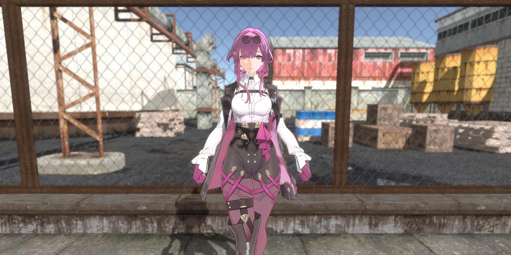
</p>

<p align="center">
  
  
  
  
</p>

<p align="center">
  🌍
  中文 |
  <a href="./README_EN.md">English</a> |
  <a href="./README_JA.md">日本語</a>
</p>

<p align="center">
  📥
  <a href="#-用户手册">用户手册</a> |
  <a href="#-丰富的渲染功能">功能一览</a> |
  <a href="CHANGELOG.md">更新日志</a>
</p>

# AleToonURP
面向 Unity URP 的 `高性能` `NPR`（二次元卡通）渲染管线 & Shader。\
实现了大多数二次元渲染中常用的美术效果，并且能在 PC、移动端等大多数平台上运行。

## 📜 目录
- [概述](#-概述)
- [主要特性](#-主要特性)
- [环境要求](#-环境要求)
- [安装](#-安装)
- [用户手册](#-用户手册)
- [多样化的美术风格](#-多样化的美术风格)
- [NPR风格的水面](#-npr风格的水面)
- [高效的性能表现](#-高效的性能表现)
  - [1.UberShader](#1ubershader)
  - [2.SRP-Batcher](#2srp-batcher)
- [丰富的渲染功能](#-丰富的渲染功能)
  - [1.基础设置 Basic](#1基础设置-basic)
  - [2.基础贴图 BaseMap](#2基础贴图-basemap)
  - [3.法线贴图 NormalMap](#3法线贴图-normalmap)
  - [4.外描边 Outline](#4外描边-outline)
  - [5.边缘光 RimLight](#5边缘光-rimlight)
  - [6.高光 HighLight](#6高光-highlight)
  - [7.自发光 Emissive](#7自发光-emissive)
  - [8.材质捕获 MatCap](#8材质捕获-matcap)
  - [9.光照设置 Light Setting](#9光照设置-light-setting)
- [更新日志](#-更新日志)
- [许可证](#-许可证)

## 📋 概述
这是一个基于 `Unity 2022.3(URP 14.x)` 开发的`NPR`二次元卡通渲染Shader。\
实现了大多数二次元卡通渲染中常用的美术效果。\
编写Shader时尽力保证其`性能高效`，以便它能够在大多数平台(主机或移动端)上使用。\
同时开发了Shader的`自定义编辑器界面`，使创作者在使用时能够更加方便快捷。

## ✨ 主要特性
| 特性 | 描述 |
| :--- | :--- |
| NPR 卡通渲染 | 涵盖暗部、外描边、边缘光、高光、自发光、MatCap 等二次元风格常用美术效果的 `AleToonURP/Lit` Shader。 |
| NPR 风格水面 | 具备深度水色渐变、多层波形、反射、折射、岸边泡沫的 `AleToonURP/Water Plane` Shader。 |
| UberShader | 通过预处理宏，根据材质球上的效果开关自动生成对应的 Shader 变体，仅启用所需功能。 |
| 自定义 ShaderGUI | 折叠式的清晰界面，可逐步设置各项功能，让美术高效地制作材质球。 |
| 高效性能 | 支持 SRP-Batcher / GPU-Instance 等合批渲染方式，优化 DrawCall。 |
| 多平台支持 | 高性能设计，可在 PC、移动端等大多数平台上运行。 |

## 💻 环境要求
- 基于 `Unity 2022.3`（URP 14.x）开发并验证。
- 渲染管线：`Universal Render Pipeline (URP) 14.x`
- 支持平台：兼容 Shader 的 PC、移动端等大多数平台。

## 📦 安装
在 Unity 中打开 `Window → Package Manager`，点击左上角 `+ → Add package from git URL...`，输入以下地址：

```
https://github.com/AleFeng/AleToonURP.git?path=Assets/PluginsDeveloper/AleToonURP
```

安装完成后，可在 Package Manager 的本包页面展开 `Samples`，导入示例材质与贴图。

<br/>
<br/>

## 📖 用户手册
**[中文版用户手册](Document~/UserManual.md)**\
**[English User Manual](Document~/UserManual_en.md)**\
用户手册中详细说明了Shader编辑器界面上所有功能的`特性`与`使用方式`。

> [!TIP]
> 建议在开始使用AleToonURP之前浏览用户手册，以便`快速了解`并掌握。

<br/>
<br/>

## 🎨 多样化的美术风格
通过编辑材质球属性，你能够非常方便地实现各类`美术风格`的渲染效果。

> [!TIP]
> 开始创作前，建议先`明确目标美术风格`或找到`合适的参考图`。\
> 再根据目标美术风格对材质球属性进行`针对性的编辑`。\
> 这样更容易达到精准且优秀的美术效果。

▼ AleToonURP/Lit\
\
▼ Universal Render Pipeline/Lit（通用渲染管线）\
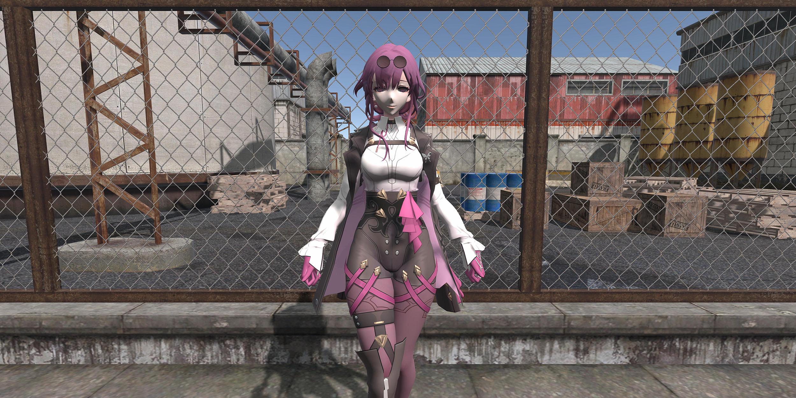

▼ AleToonURP/Lit\
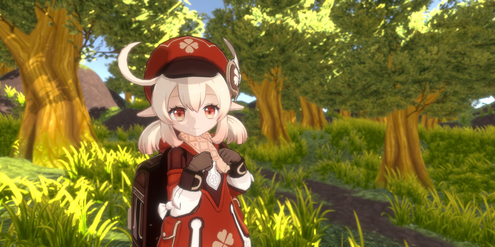\
▼ Universal Render Pipeline/Lit（通用渲染管线）\
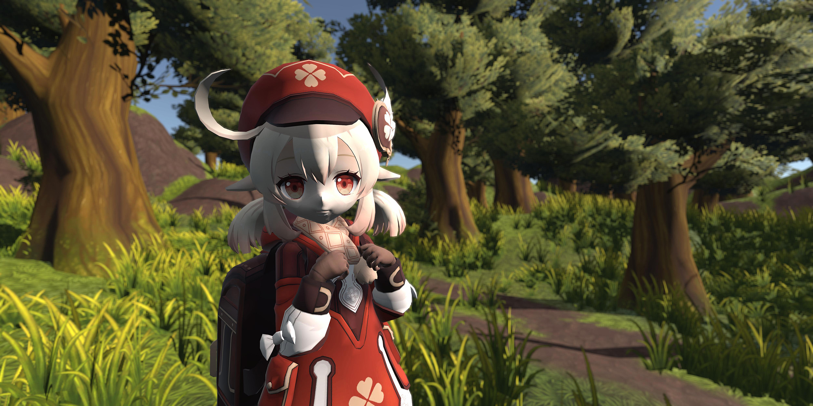

<br/>
<br/>

## 🌊 NPR风格的水面
实现了NPR风格的水面渲染效果。\
根据`水下深度`对水体颜色进行`插值变化`。可自定义设置浅水颜色、深水颜色、透明度。\
通过`多层波形`叠加来获得细腻自然的`水面波浪`效果。可自定义设置主次波形的缩放与强度、移动速度。\
通过CubeMap来表现水面的`场景反射效果`。可自定义设置反射强度、模糊、菲涅尔效果。\
通过对摄像机帧缓冲贴图采样，并进行扭曲与偏移，来实现水底物体的`折射效果`。\
通过摄像机深度图来获得水下深度，实现水体与岸边接触的`边缘区域泡沫`。可自定义设置阈值贴图、阈值裁剪、距离、模糊与透明度。\
▼ AleToonURP/Water Plane\
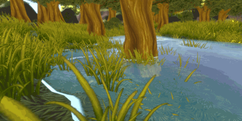

<br/>
<br/>

## ⚡ 高效的性能表现
使用高效的方式编写Shader，并对其进行性能优化。支持SRP-Batcher、GPU-Instance等合批渲染方式。

### 1.UberShader
使用宏定义分支预处理的方式来制作UberShader。\
根据材质球上的效果开关来`自动生成`对应的Shader变体。\
提高Shader的易用性，使美术能够更加`简单高效`地制作材质球。\


### 2.SRP-Batcher
支持Unity的SRP-Batcher功能，提高CPU端处理DrawCall预设置工作的效率。\
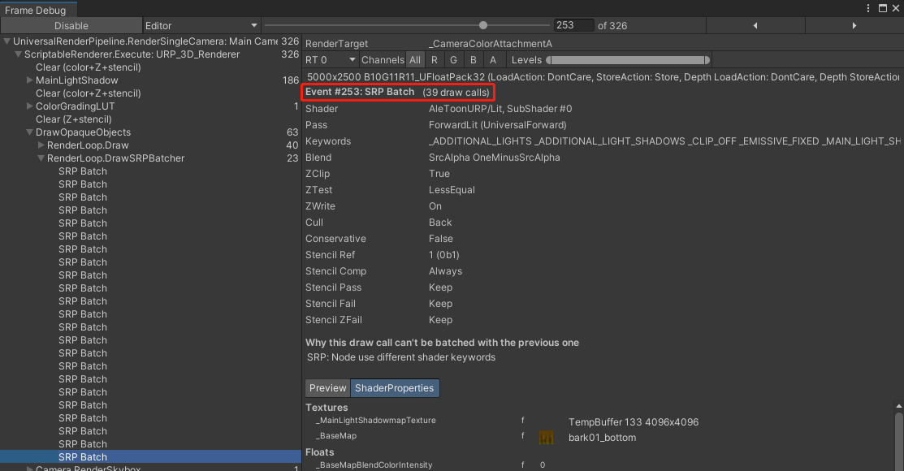

<br/>
<br/>

## 🧩 丰富的渲染功能
实现了大多数卡通渲染的主流效果，并编写了自定义的ShaderGUI。使创作时的工作流程变得`清晰且高效`。\
你能够根据折叠界面的顺序`逐步设置`材质球的各项`渲染功能`。按照美术效果的需求`单独`设置`打开`或`关闭`。

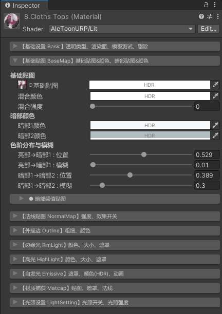

<br/>
<br/>

### 1.基础设置 Basic
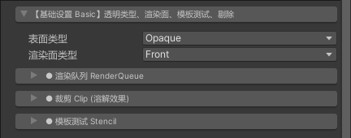

#### 1.1.渲染队列 Render Queue
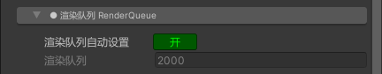

#### 1.2.裁剪 Clip
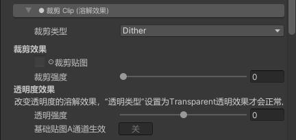

#### 1.3.模板测试 Stencil
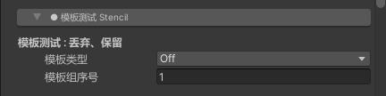

<br/>
<br/>

### 2.基础贴图 BaseMap
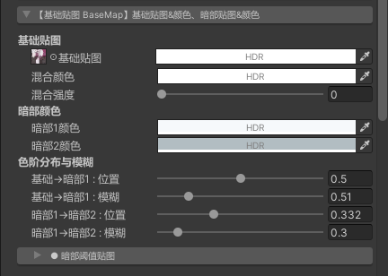

#### 2.1.暗部阈值贴图 Shade ThresholdMap
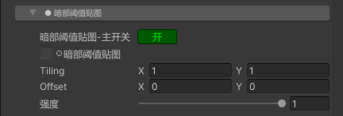

<br/>
<br/>

### 3.法线贴图 NormalMap
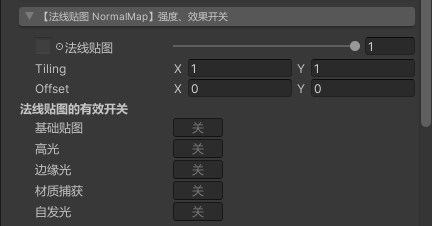

<br/>
<br/>

### 4.外描边 Outline
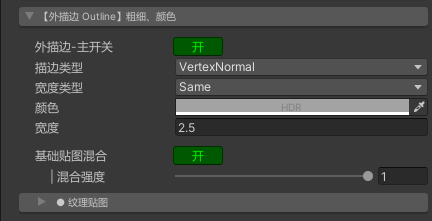

#### 4.1.纹理贴图 TexMap
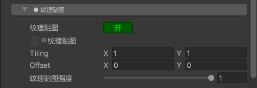

<br/>
<br/>

### 5.边缘光 RimLight
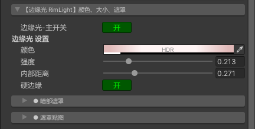

#### 5.1.暗部遮罩 ShadeMask
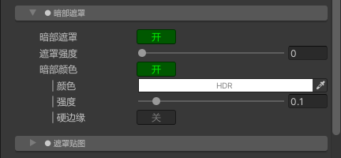

#### 5.2.遮罩贴图 MaskMap
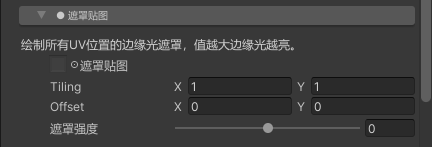

<br/>
<br/>

### 6.高光 HighLight
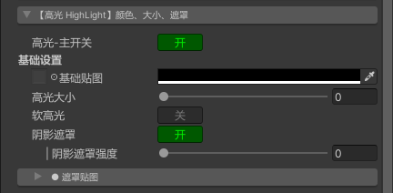

#### 6.1.遮罩贴图 MaskMap
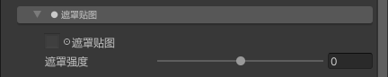

<br/>
<br/>

### 7.自发光 Emissive
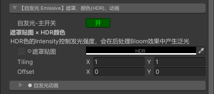

#### 7.1.自发光动画 Emissive Animation
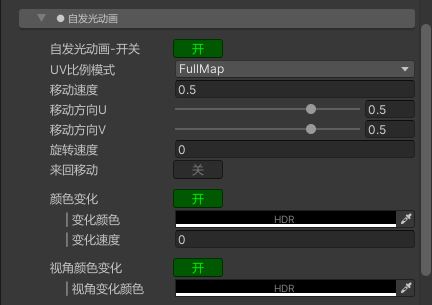

<br/>
<br/>

### 8.材质捕获 MatCap
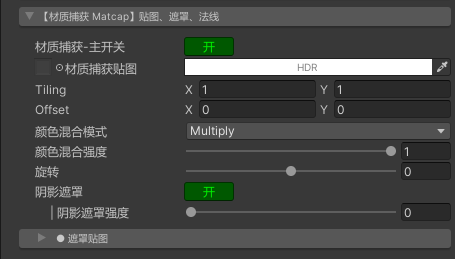

#### 8.1.遮罩贴图 MaskMap
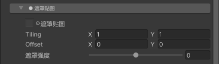

<br/>
<br/>

### 9.光照设置 Light Setting
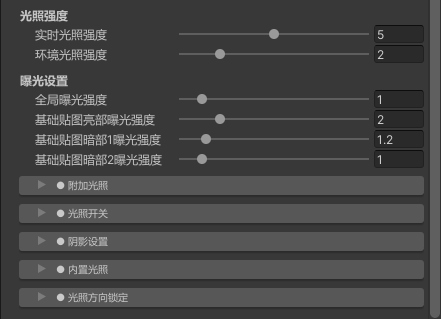

#### 9.1.附加光照 Additive Light
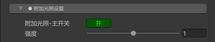

#### 9.2.光照开关 Light Toggle
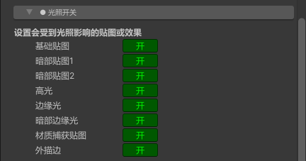

#### 9.3.阴影设置 Shadow Setting
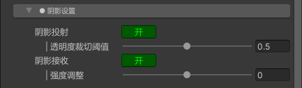

#### 9.4.内置光照 BuiltIn Light
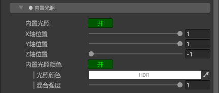

#### 9.5.光照方向锁定 Direction Lock
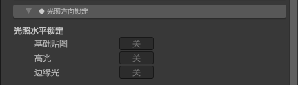

<br/>
<br/>

## 📝 更新日志
详细的更新内容请查看 [CHANGELOG.md](CHANGELOG.md)。

## 📄 许可证
本项目基于 [MIT License](LICENSE) 开源。
