# 【AleToonURP Ver-1.2.1】
***阅读中文版文档 [中文版本](README_cn.md)*** \
***日本語のドキュメントを読む [日本語](README.md)*** \
***Read this document in [English](README_en.md)*** 

***[更新日志](CHANGELOG.md)***

## 【概述】
---
これは`Unity2021.3LTS(URP 12.x)`に基づいて開発された`NPR`のレンダリングパイプラインとシェーダー。\
ほとんどの二次元レンダリングでよく使用される美術効果を実現しました。\
できるだけ`高性能`のシェーダーを開発し，ほとんどのプラットフォーム（パソコン、モバイル等）で使用できるようにしました。\
シェーダーの`GUI`も開発し，アーティストにとって使いやすく、便利になりました。

## 【用户手册】
---
**[中文版用户手册](Document~/UserManual.md)**\
**[English User Manual](Document~/UserManual_en.md)**\
ユーザーマニュアルはシェーダーの全て機能の`特性`や`使い方`を詳しく説明します。\
AleToonURPの使用を始める前に、ユーザーマニュアルを参照することをお勧めします。`速く理解し`、習得するために。

 
 

## 【多様化なアートスタイル】
---
マテリアルのプロパティを調整することで、様々な`アートスタイル`のレンダリングを便利に実現できます。\
作成を始める前に、まずは`目標とするアートスタイル`か、`適切なリファレンスイメージ`を見つけることをお勧めします。\
そして、目標とするアートスタイルに合わせて、マテリアルのプロパティを`対応的に調整します`。\
それにより、確実で優れた美術効果を達成し易くなります。\

▼ AleToonURP/Lit\
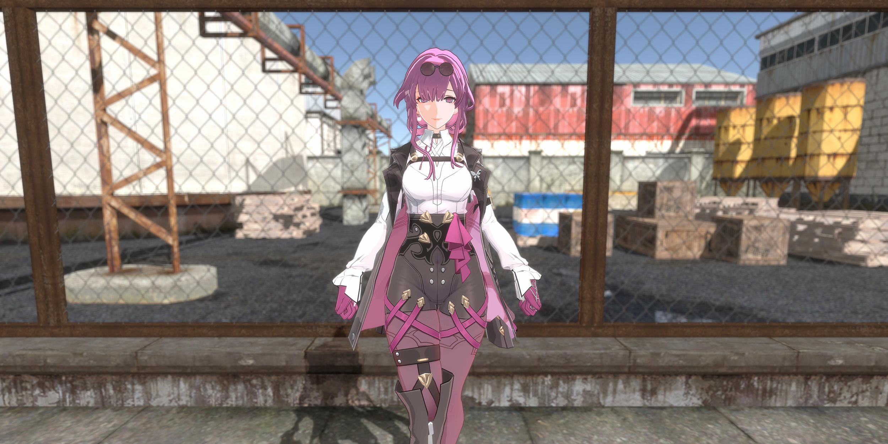\
▼ Universal Render Pipeline/Lit（通用レンダリングパイプライン）\
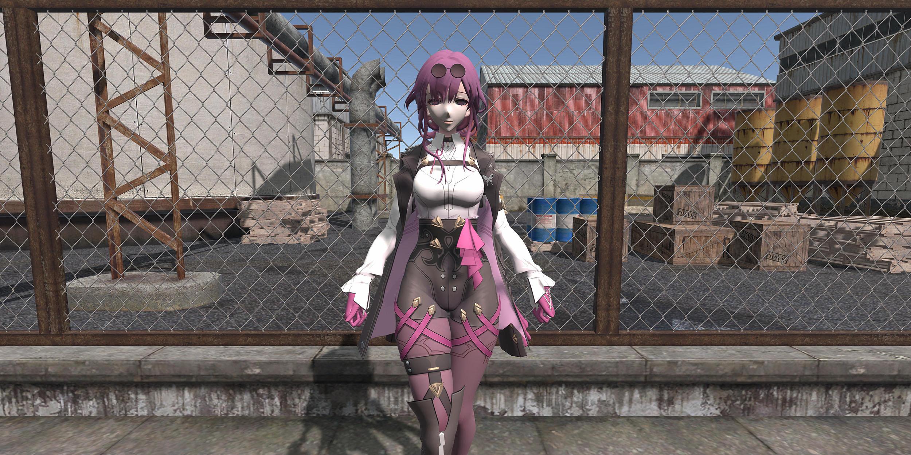

▼ AleToonURP/Lit\
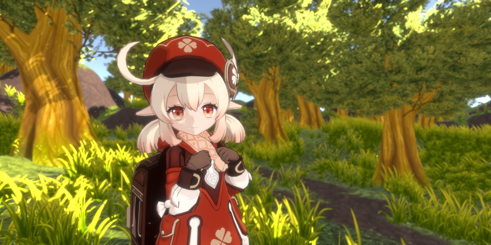\
▼ Universal Render Pipeline/Lit（通用レンダリングパイプライン）\

 
 

## 【NPRスタイルの水面】
---
NPRスタイルの水面のレンダリングを実現しました。\
`水中深度`のおうじて、水の色を徐々に`変化させる`。浅水の色や深水の色、透明度等を自由に調整できます。\
`複数の波`を重ねることで、繊細で自然な水面の`波浪の効果`を得られます。第一と第二波形の大小や強度、移動速度等を調整できます。\
キューブマップを使用して水面の`シーン反射効果`を表現します。反射の強度や模糊度、フレネル効果等を調整できます。\
カメラのフレームバッファをサンプリングし、画面の捩れと変位をすることで、水中の物を`屈折させる効果`を実現しました。\
カメラのデプスバッファをサンプリングし、水面と岸辺に接するの`辺縁部分の泡沫`を実現しました。マスクマップや範囲、距離、模糊度、透明度等を調整できます。\
▼ AleToonURP/Water Plane\

 
 

## 【高效的性能表现】
---
効率な方法でシェーダーを開発し、性能の最適化も行いました。SRP-BatcherやGPU-Instance等のバッチレンダリング方式もできます。

### **1.UberShader**
---
前処理マクロの方法を使用し、Uberシェーダーを開発しました。\
マテリアルの効果の開閉に基づいて、対応なシェーダーの変体を`自動的に生成`します。\
シェーダーの便利さを向上し、アーティストが`簡単で効率的`にマテリアルを作成できるようになりました。\

### **2.SRP-Batcher**
---
UnityのSRP-Batcher機能もでき、CPU側でDrawCallのプリセットの効率を向上させます。\
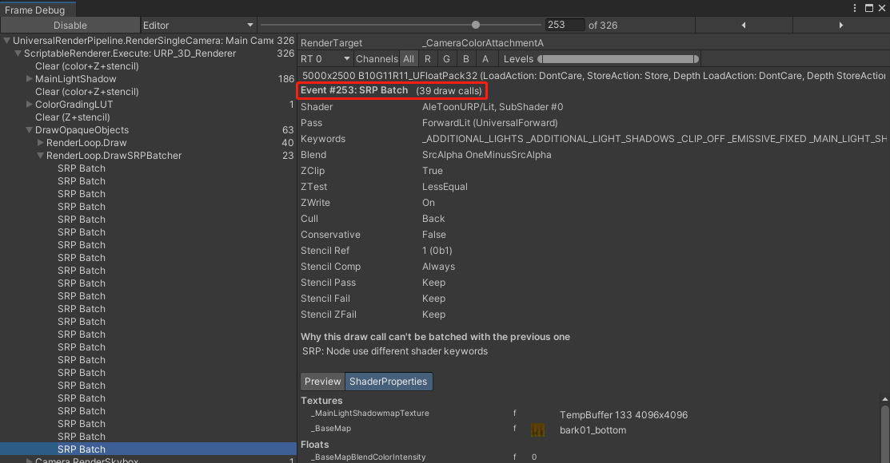

 
 

## 【丰富的渲染功能】
---
ほとんどの二次元スタイルのレンダリング効果を実現し、カスタムのシェーダーGUIも開発しました。
マテリアルを制作する時のワークフローを`確実で効率的`になりました。\
インタフェースの折りたたみバーの順番を基づいて、マテリアルのレンダリング機能を`逐次設定する`こともできます。\
美術効果の要望を応じて、`個別`に`開ける`又は`閉める`こともできます。\

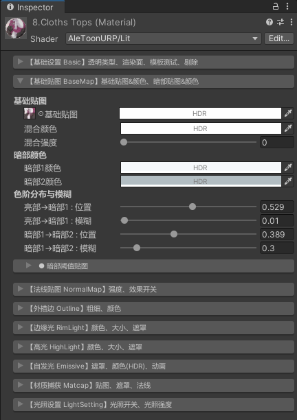

 
 

### **1.基本設定 Basic**
---

#### 1.1.レンダリング隊列 Render Queue
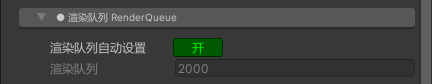

#### 1.2.裁断 Clip

#### 1.3.ステンシルテスト　Stencil

 
 

### **2.基本マップ BaseMap**
---

#### 2.1.暗部の閾値マップ Shade ThresholdMap
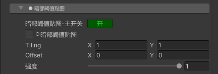

 
 

### **3.法線マップ NormalMap**
---
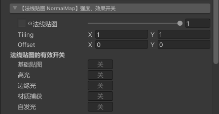

 
 

### **4.外側の描線 Outline**
---

#### 4.1.描線の肌理マップ TexMap
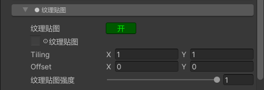

 
 

### **5.縁辺の光 RimLight**
---

#### 5.1.暗部のマスクマップ ShadeMask

#### 5.2.マスクマップ MaskMap
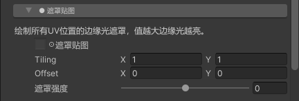

 
 

### **6.ハイライト HighLight**
---

#### 6.1.マスクマップ MaskMap

 
 

### **7.発光 Emissive**
---

#### 7.1.発光のアニメーション Emissive Animation

 
 

### **8.マテリアルキャプチャ MatCap**
---
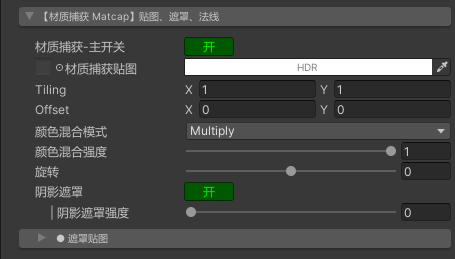

#### 8.1.マスクマップ MaskMap

 
 

### **9.ライトの設定 Light Setting**
---
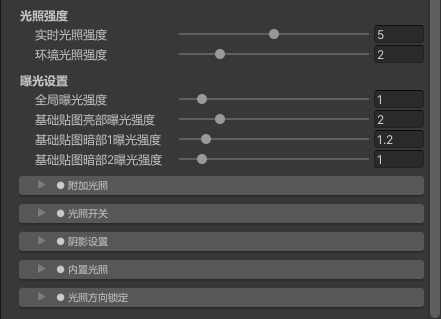

#### 9.1.アディショナルライト Additive Light

#### 9.2.ライトの開閉 Light Toggle
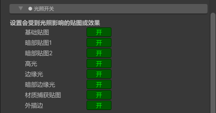

#### 9.3.陰影の設定 Shadow Setting
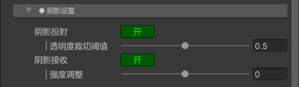

#### 9.4.内蔵ライト BuiltIn Light

#### 9.5.ライト方向の固定 Direction Lock
