# 【AleToonURP Ver-1.2.1】
***阅读中文版文档 [中文版本](README_cn.md)*** \
***日本語のドキュメントを読む [日本語](README.md)*** \
***Read this document in [English](README_en.md)*** 

***[更新日志](CHANGELOG.md)***

## 【概述】
---
这是一个基于 `Unity 2021.3LTS(URP 12.x)` 开发的`NPR`二次元卡通渲染Shader。\
实现了大多数二次元卡通渲染中常用的美术效果。\
编写Shader时尽力保证其`性能高效`，以便它能够在大多数平台(主机或移动端)上使用。\
同时开发了Shader的`自定义编辑器界面`，使创作者在使用时能够更加方便快捷。

## 【用户手册】
---
**[中文版用户手册](Document~/UserManual.md)**\
**[English User Manual](Document~/UserManual_en.md)**\
用户手册中详细说明了Shader编辑器界面上所有功能的`特性`与`使用方式`。\
建议在开始使用AleToonURP之前浏览用户手册，以便`快速了解`并掌握。

 
 

## 【多样化的美术风格】
---
通过编辑材质球属性，你能能够非常方便地实现各类`美术风格`的渲染效果。\
开始创作前，建议先`明确目标美术风格`或找到`合适的参考图`。\
再根据目标美术风格对材质球属性进行`针对性的编辑`。\
这样更容易达到精准且优秀的美术效果。

▼ AleToonURP/Lit\
\
▼ Universal Render Pipeline/Lit（通用渲染管线）\
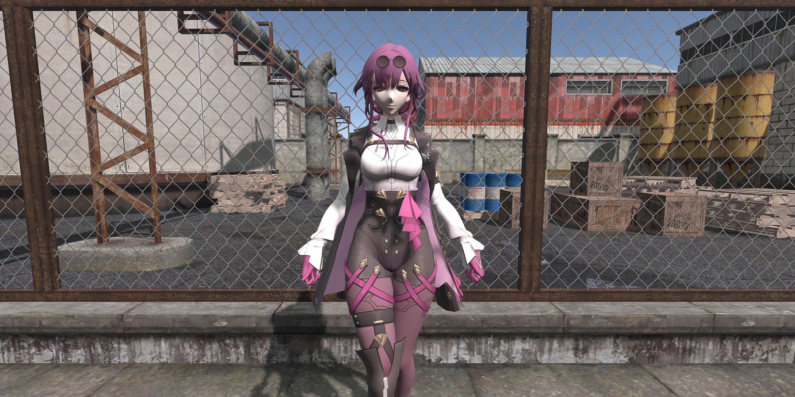

▼ AleToonURP/Lit\
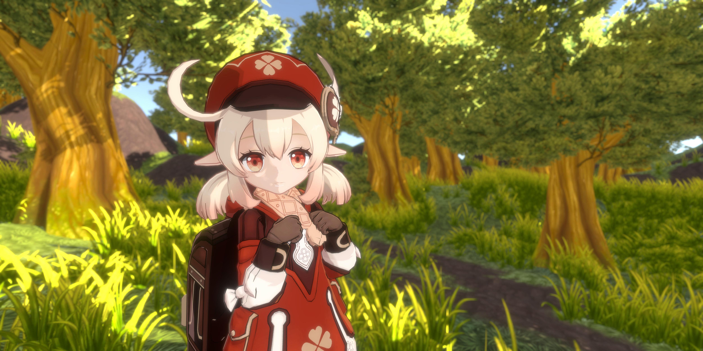\
▼ Universal Render Pipeline/Lit（通用渲染管线）\
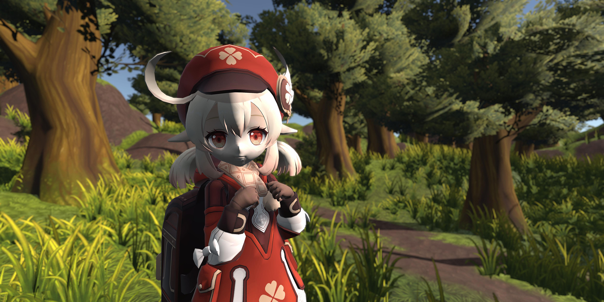

 
 

## 【NPR风格的水面】
---
实现了NPR风格的水面渲染效果。\
根据`水下深度`对水体颜色进行`插值变化`。可自定义设置浅水颜色、深水颜色、透明度。\
通过`多层波形`叠加来获得细腻自然的`水面波浪`效果。可自定义设置主次波形的缩放与强度、移动速度。\
通过CubeMap来表现水面的`场景反射效果`。可自定义设置反射强度、模糊、菲涅尔效果。\
通过对摄像机帧缓冲贴图采样，并进行扭曲与偏移，来实现水底物体的`折射效果`。\
通过摄像机深度图来获得水下深度，实现水体与岸边接触的`边缘区域泡沫`。可自定义设置阈值贴图、阈值裁剪、距离、模糊与透明度\
▼ AleToonURP/Water Plane\
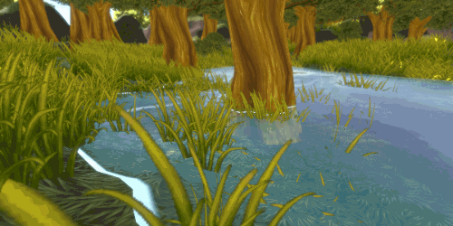

 
 

## 【高效的性能表现】
---
使用高效的方式编写Shader，并对其进行性能优化。支持SRP-Batcher、GPU-Instance等合批渲染方式。

### **1.UberShader**
---
使用宏定义分支预处理的方式来制作UberShader。\
根据材质球上的效果开关来生成对应的Shader变体。\
提高Shader复用率与易用性，降低分支带来的性能开销。\

### **2.SRP-Batcher**
---
支持Unity的SRP-Batcher功能，提高CPU端处理DrawCall预设置工作的效率。\
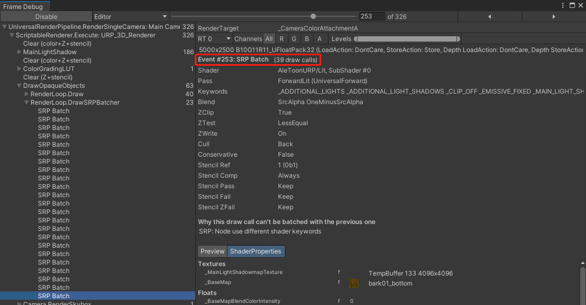

 
 

## 【丰富的渲染功能】
---
实现了大多数卡通渲染的主流效果，并编写了自定义的ShaderGUI。使创作时的工作流程变得`清晰且高效`。\
你能够根据折叠界面的顺序`逐步设置`材质球的各项`渲染功能`。按照美术效果的需求`单独`设置`打开`或`关闭`。

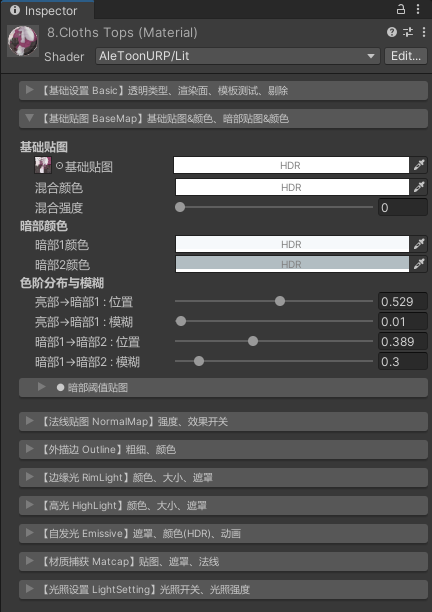

 
 

### **1.基础设置 Basic**
---
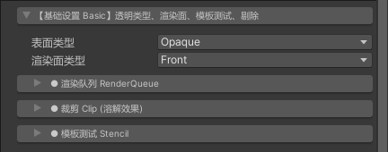

#### 1.1.渲染队列 Render Queue
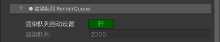

#### 1.2.裁剪 Clip
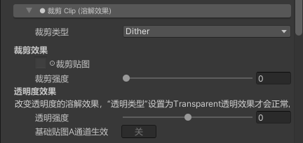

#### 1.3.模板测试 Stencil
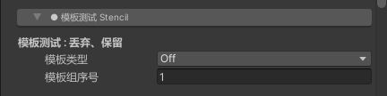

 
 

### **2.基础贴图 BaseMap**
---
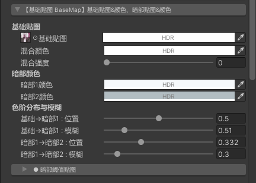

#### 2.1.暗部阈值贴图 Shade ThresholdMap
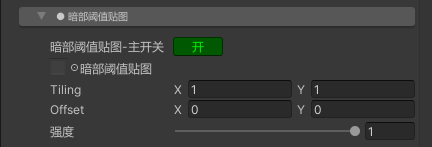

 
 

### **3.法线贴图 NormalMap**
---
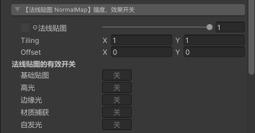

 
 

### **4.外描边 Outline**
---
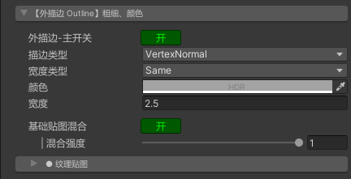

#### 4.1.纹理贴图 TexMap
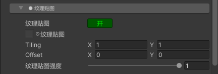

 
 

### **5.边缘光 RimLight**
---
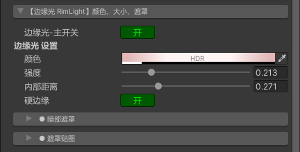

#### 5.1.暗部遮罩 ShadeMask
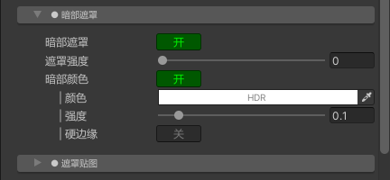

#### 5.2.遮罩贴图 MaskMap
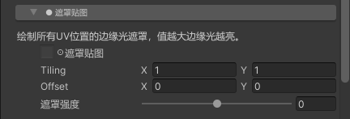

 
 

### **6.高光 HighLight**
---
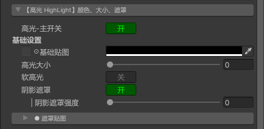

#### 6.1.遮罩贴图 MaskMap
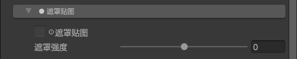

 
 

### **7.自发光 Emissive**
---
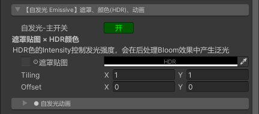

#### 7.1.自发光动画 Emissive Animation
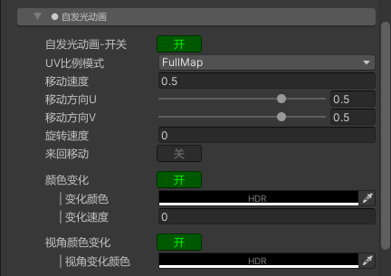

 
 

### **8.材质捕获 MatCap**
---
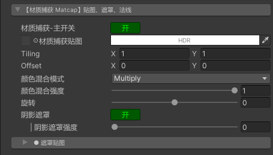

#### 8.1.遮罩贴图 MaskMap
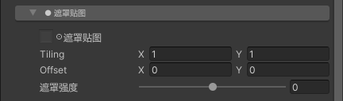

 
 

### **9.光照设置 Light Setting**
---
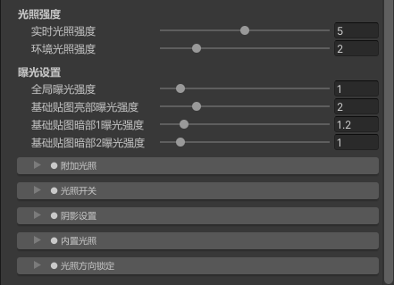

#### 9.1.附加光照 Additive Light
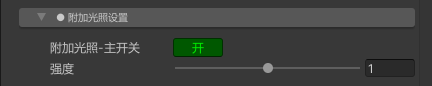

#### 9.2.光照开关 Light Toggle
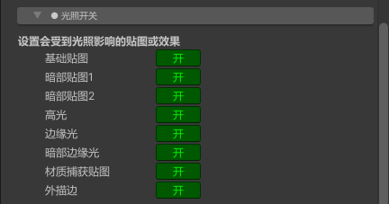

#### 9.3.阴影设置 Shadow Setting
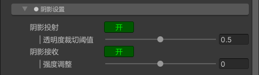

#### 9.4.内置光照 BuiltIn Light
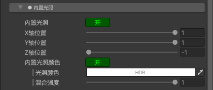

#### 9.5.光照方向锁定 Direction Lock
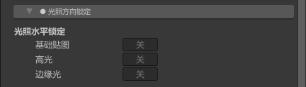